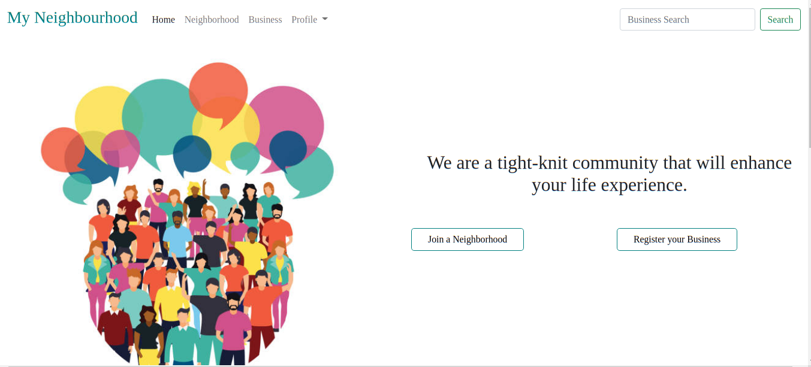
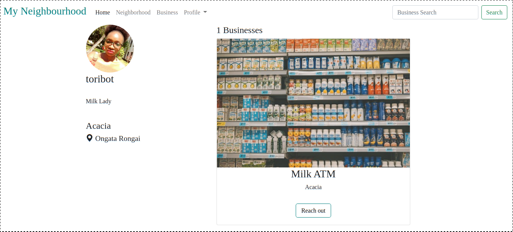
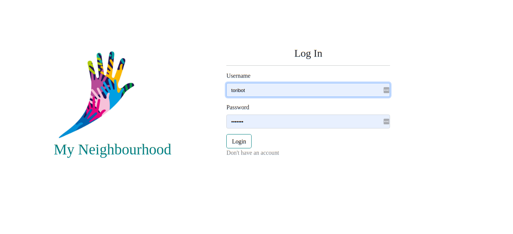

# my-neighbourhood
An application that highlights all activities in a particular location radius.

## Live link
[Live site](https://mtaa-the-hood.herokuapp.com/)

# Sample pages


 

 

# Requirements
A computer with access to internet

## Built with
* Django4
* Bootstrap5

## Technologies
* HTML5
* CSS
* Bootstrap
* Python 3.9
* Heroku
* PostgreSql

## Setup Instructions
NB: These commands are to be run on a linux/unix terminal.

* Make sure you have python installed. If not, use this command <br>
 ```sudo apt install python3.9```
* Install Postgresql for ubuntu using<br>
 ```sudo apt-get install postgresql```
* Clone the repository  by typing this command on terminal<br>
```git clone https://github.com/tori-bot/my_neighbourhood```
* Enter your local directory by typing this command on the terminal after cloning the repository<br>
 ```cd my_neighbourhood```
* Install all requirements<br>
 ```pip install -r requirements.txt```
* Test the application<br> ```python3 manage.py test```
* Run the server on local machine <br>
```python3 manage.py runserver```
* Follow the local host link<br>
 ```127.0.0.1:8000``` 
 to view application on your browser.
* For instructions on deployment to Heroku follow this document <br> [Heroku deployment](https://gist.github.com/newtonkiragu/42f2500e56d9c2375a087233587eddd0)

## Known Bugs
* Dashboard conflicts

# License

Copyright (c) 2022 MIT License. [View License Here](LICENSE)


# Author
Email Address: [makenavictoria1@gmail.com](mailto:makenavictoria1@gmail.com)
